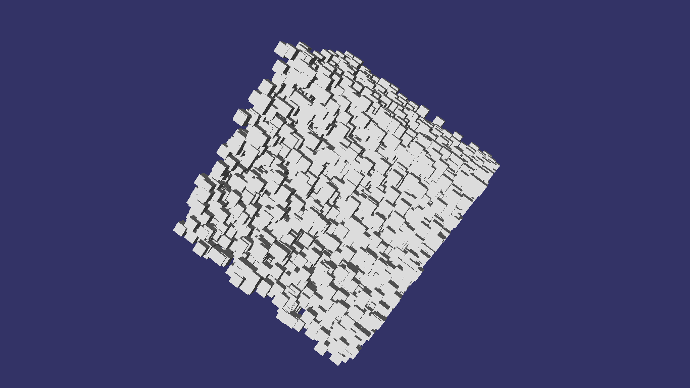

# osg-experiments

Quelques exemples écrits en 2013/2014 pour la prise en main de [OpenSceneGraph](https://en.wikipedia.org/wiki/OpenSceneGraph) :

## Construction

* Installer les pré-requis :

```bash
# Un compilateur et cmake
sudo apt-get install clang cmake
# OpenSceneGraph
sudo apt-get install libopenscenegraph-dev
# Quelques bibliothèques boost
sudo apt-get install libboost-all-dev
```

* Construire avec cmake :

```bash
# préparer un dossier
mkdir build
cd build
cmake ..
# construire les exécutables
make
```

## Utilisation

```bash
# simulation attraction n-corps
./build/osg-nbody
# affichage MNT au format ASC
./build/osg-dem data/dem/reunion.asc
# ...
```


## Screenshot



