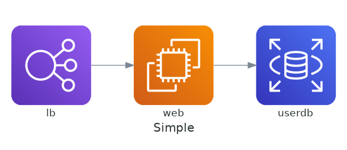

# Diagrams

Quelques notes pour la prise en main de [Diagrams (diagrams.mingrammer.com)](https://diagrams.mingrammer.com/docs/getting-started/examples) qui s'appuie sur [Graphviz](https://graphviz.org/) pour générer des schémas d'architecture.

## Installation

```bash
sudo apt install graphviz
pip install --user diagrams
```

## Usage

### Conversion d'un fichier

Il suffit d'appeler `python helloworld.py` pour générer le schéma :

```py
# helloworld.py
from diagrams import Diagram
from diagrams.aws.compute import EC2
from diagrams.aws.database import RDS
from diagrams.aws.network import ELB

graph_attr = {
    "margin":"-1.8, -1.8"
}

with Diagram("Simple", filename="helloworld", graph_attr=graph_attr, show=False):
    ELB("lb") >> EC2("web") >> RDS("userdb")

```

=>



### Conversion des fichiers dans un dossier

Le bon vieux [Makefile](Makefile) suivant fera l'affaire :

```makefile
SRC=$(wildcard *.py)

.PHONY: build
build: $(SRC)
	python $^
```

## Ressources

* [diagrams.mingrammer.com - Examples](https://diagrams.mingrammer.com/docs/getting-started/examples)
* [graphviz.org - Graph Attributes](https://graphviz.org/docs/graph/) (c.f. `graph_attr` dans l'exemple contrôler la marge)
