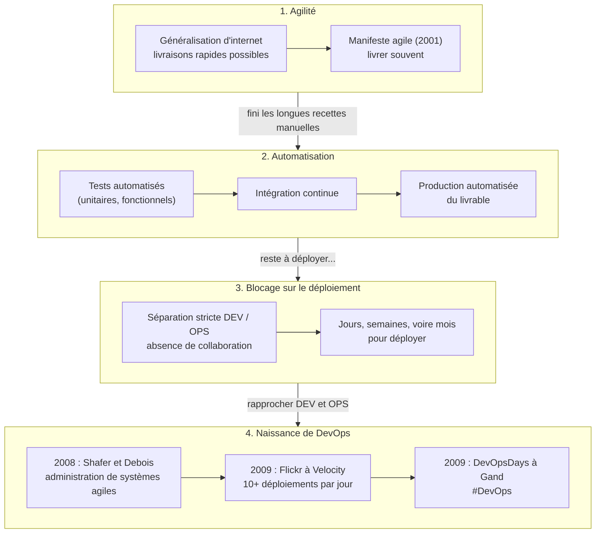

# DevOps - Les origines

Cette fiche est une annexe du [cours-devops - Les origines de DevOps](https://mborne.github.io/cours-devops/origines.html) qui prend une approche historique pour expliquer la genèse de DevOps.

## Schéma de synthèse

Le schéma ci-après réalisé avec Claude fait une synthèse des [points clés](#points-cles) de la génèse de DevOps :

## Points clés

- La généralisation d'internet rend possible des livraisons rapides d'évolutions et de correctifs.
- **Le manifeste agile (2001) invite à tirer profit de cette possibilité en livrant souvent des solutions opérationnelles**.
- Livrer rapidement induit que l'on ne peut plus procéder à de longues recettes manuelles.
- Il devient crucial d'automatiser au maximum les recettes avec des tests unitaires et fonctionnels.
- Pour s'assurer que ces tests sont exécutés, il est possible de s'appuyer sur des orchestrateurs d'intégration continue.
- Une fois l'exécution des tests automatisée, il devient tentant d'automatiser la production d'un livrable.
- Le blocage intervient sur le déploiement : **les procédures, la séparation stricte des rôles de développeurs (DEV) et d'opérateurs (OPS), couplée à une absence de collaboration, induisent qu'il n'est pas possible de livrer rapidement** (il faut des jours, voire des semaines ou des mois pour provisionner les environnements et déployer une application).
- L'agilité dans les développements n'est possible qu'en rapprochant les DEV et les OPS et en introduisant de l'agilité dans la gestion des infrastructures !
- En 2008, Andrew Shafer qui porte un sujet « Infrastructure Agile » rencontre Patrick Debois qui observe le manque de cohésion entre les développeurs et les opérateurs et présente lui-même « Agile Infrastructure and Operations » : ils discutent et développent le concept « d’administration de systèmes agiles ». 
- **DevOps naît en 2009** quand ils lancent le hashtag #DevOpsDay.

## Références

- [manifesteagile.fr - Manifeste pour le Développement Agile de Solutions](https://manifesteagile.fr/).
- [devopssec.fr - L'histoire du DevOps](https://devopssec.fr/article/histoire-du-devops) (en français).
- John Allspaw et Paul Hammond, « 10+ Deploys Per Day: Dev and Ops Cooperation at Flickr » (Velocity 2009), la présentation qui a inspiré Patrick Debois :
    - [slideshare.net - Diapositives](https://www.slideshare.net/jallspaw/10-deploys-per-day-dev-and-ops-cooperation-at-flickr)
    - [youtube.com - Vidéo](https://www.youtube.com/watch?v=LdOe18KhtT4)
- [youtube.com - The (Short) History of DevOps](https://www.youtube.com/watch?v=o7-IuYS0iSE) (Damon Edwards, 2012)
- [devops.com - The Origins of DevOps: What's in a Name?](https://devops.com/the-origins-of-devops-whats-in-a-name/) (Steve Mezak, 2018)
- [itrevolution.com - The DevOps Handbook](https://itrevolution.com/product/the-devops-handbook-second-edition/)

