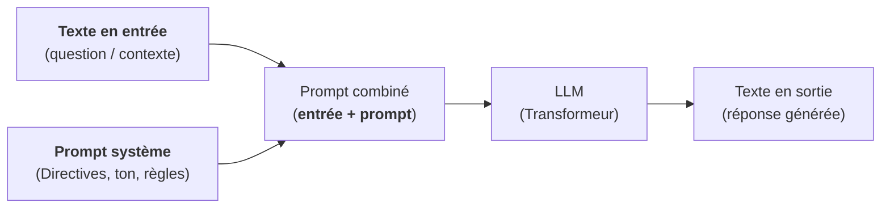
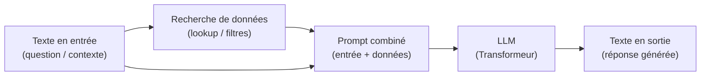

---
tags:
    - LLM
    - Principe de fonctionnement
    - Techniques avancées
search:
    boost: 3
---

# Les LLM

## Points clés

- Un LLM produit un **texte en sortie à partir d'un texte en entrée**.
- Un LLM est sans état (pour les conversations, le texte en entrée est l'historique de la discussion + le nouveau message de l'utilisateur).
- Un LLM n'a pas d'accès aux données (plusieurs techniques permettent de récupérer les données utiles en amont de la production de la réponse : [RAG](#le-rag-retrieved-augmented-generation), [tool calling](#le-tool-calling),...)

## Comment ça marche?

Un LLM est réseau de neurone de type [Transformeur](https://fr.wikipedia.org/wiki/Transformeur) avec en entrée et en sortie un texte (il en existe d'autres types, par exemple pour convertir un texte en une image).

Sans aller dans les détails, il convient de noter que :

- Les réseaux de neurones travaillent avec des nombres.
- Le texte en entrée est donc transformé en une suite de nombres (*token*) [^1] et l'opération inverse est appliquée sur la sortie.
- La taille du modèle est liée au nombres de paramètres du réseau de neurone.
- En général [^2], plus le modèle est gros, plus il est puissant.

[^1]: Ne pas confondre avec la notion d'*embedding* (i.e. conversion d'un texte en vecteur sémantique)
[^2]: En réalité, il y a plusieurs architecture de modèles (modèles denses, modèles creux, *Mixture-of-Experts*,...) et ça n'est pas toujours vrai.

## Concepts avancés

### Le prompt système

Le **prompt système** est un texte préposé devant le texte en entrée afin d'orienter la réponse :

### Le RAG (Retrieved Augmented Generation)

Le **RAG (Retreived Augmented Generation)** est une technique consistant à **rechercher des données en fonction du texte en entrée** avant de demander au LLM de **produire la réponse finale** :

Il convient de souligner que **la recherche des données est traitée au niveau de l'applicatif** exploitant un LLM et qu'**il y a plusieurs approches possibles pour récupérer les données utiles** :

- Faire une **recherche sémantique** dans une base vectorielle après conversion du texte en entrée en vecteur sémantique (*embedding*).
- Faire une **recherche full-texte** après extraction de mots clés à partir du texte en entrée.
- Faire une **requête SQL** ou un **appel d'API** après extraction des paramètres à partir du texte en entrée (ex : `theme`)
- ...

### Le *tool calling*

Dans le cas du *tool calling*, le LLM reçoit le texte en entrée et une description des outils disponibles (nom, description, paramètres). Il peut alors :

- Demander d'appeler un ou plusieurs outils
- Extraire les paramètres pour chaque appel

**La réponse finale est produite à partir du texte en entrée et du résultat des appels des outils**.

Par exemple, pour la question "Quelle heure est-il ?" :

- Le LLM identifie qu'il doit appeler l'outil `get_current_time()`
- L'application traite l'appel et fournit l'heure au LLM pour la génération de la réponse finale.

Pour la question "quelle est l'altitude de la tour Eiffel", il pourra demander l'appel à `geocode("tour Eiffel") -> [2.94694, 48.858093]` puis à `altitude(2.94694, 48.858093)`.

Nous noterons que :

- **Les appels d'outil sont traités au niveau de l'application**.
- Tous les modèles ne supportent pas le *tool calling* (voir [tag "tools" sur les modèles Ollama](https://ollama.com/search))
- Les outils peuvent prendre la forme de **fonctions développées dans le même langage que l'application**.
- En alternative, [MCP (Model Context Protocol)](../mcp/index.md) permet de **standardiser la mise à disposition de ces outils** sous forme de service.

### RAG vs Tool Calling

- Le RAG peut être traité sous forme d'un appel d'outil (ex : `recherche(keywords)`)
- **L'appel d'outil offre plus de possibilités que le RAG : Appel d'API, création de fichier, exécution de commande...**

## Les techniques de rendu

!!!warning "IMPORTANT"
    L'affichage d'un tableau, d'un graphique ou d'une carte n'est pas du ressort du LLM mais de l'application!

### Le formatage markdown

De nombreux modèles produisent naturellement des réponses avec un [formatage markdown](https://www.markdownguide.org/cheat-sheet/).

Il suffit donc de convertir le texte en sortie du LLM au format markdown en HTML pour afficher des listes à puce, des liens, des tableaux,...

### La cartographie

Pour **afficher une carte**, il est **possible en première approche de générer une image (carte statique)**, par exemple en appelant un serveur WMS.

Pour aller plus loin, il est possible de s'appuyer sur des bibliothèques JavaScript telles OpenLayers ou Leaflet pour **afficher des données** ou **appliquer une symbologie** (le style pouvant être généré par un LLM).

La **mise en oeuvre d'interraction en langage naturel avec une carte (ex : zoom sur l'église) sera plus potentiellement complexe** car elle implique :

- La **création d'un grand nombre d'outils** (autant qu'il y a de contrôle sur une carte : zoom in/out, zoom sur un lieu, charger des données, gérer des styles,...)
- La **mise en oeuvre d'une communication entre le navigateur et un serveur** pour l'exécution des appels d'outils (si l'agent s'exécute côté serveur) [^3]

[^3]: Pour y voir plus clair, il faudra que je prenne un peu de temps pour expérimenter le développement d'un tool `get_user_current_position` permettant de redescendre côté serveur [la position obtenue à l'aide de l'API Geolocation du navigateur](https://www.w3schools.com/html/html5_geolocation.asp)

### Les SIG

Il est possible de mettre à disposition des outils permettant de communiquer avec un SIG tels QGIS (voir [QGISMCP - tools](https://github.com/jjsantos01/qgis_mcp#tools)).

---

## Expérimenter localement

Pour aller plus loin et mieux comprendre le fonctionnement des LLM, il est intéressant de tester localement des petits modèles. Plusieurs options sont possibles :

- [Ollama](../../outils/ollama/index.md) (CLI et API REST/JSON)
- [Hugging Face - Text Generation](../../outils/huggingface/index.md#text-generation) (Python)
