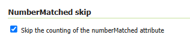

---
tags:
    - Outil
    - Données géographiques
    - Service
    - OGC
search:
    boost: 2
---

# GeoServer

> 🤖 Rédaction assistée par IA.

GeoServer est un serveur open source de diffusion de données géographiques.

Il permet de publier des couches raster et vectorielles via des standards OGC (WMS, WMTS, WFS) et des API HTTP simples, avec un style cartographique configurable.

## Cas d'utilisation

* publier des données SIG pour des clients web (OpenLayers, Leaflet, MapLibre),
* exposer des données métiers stockées en base (PostGIS) ou dans des fichiers,
* servir de brique de base d'une infrastructure de données géographiques,
* déléguer la production de tuiles et la gestion de styles cartographiques.

## Installation

Avec Docker (recommandé pour démarrer) :

- [Docker - How to run official release?](https://github.com/geoserver/docker#how-to-run-official-release)

Interface d'administration :

* URL : <http://localhost:8080/geoserver>
* identifiants par défaut : `admin` / `geoserver`

## Exemples

### Ajouter un workspace et un datastore PostGIS

1. Créer un workspace (ex: `cadastre`).
2. Ajouter un datastore de type PostGIS.
3. Publier une table ou une vue en tant que couche.

URL typique du datastore PostGIS :

```text
host=postgres
port=5432
database=gis
schema=public
user=gis
password=***
```

4. Prévisualiser la couche

## Points d'attention

### Sécurité

- changer les identifiants par défaut, limiter l'accès à l'interface d'administration et activer TLS côté reverse proxy.

### Performances

- Indexer correctement les tables PostGIS (index spatiaux et index classiques en fonction des filtrages dans les styles et requêtes WFS)
- WMS : éviter les styles trop coûteux.
- WMTS : activer le cache de tuiles (GeoWebCache intégré)
- WFS : si vous avez de nombreux objets (ex : 51 millions de bâtiment)
    - **Surveiller le support de "queryable"** pour bloquer les filtrages impliquant les propriétés non indexées.
    - **Désactiver le calcul de `numberMatched` qui induit des `SELECT count(*)` pour chaque requête** dans "Publishing" :



### CRS/projections

- Vérifier le SRID des données source et la cohérence des projections exposées.
- ATTENTION : `EPSG:4326` correspondant à lat,lon pour GeoServer (vs PostGIS). Utiliser `CRS:84` pour des coordonnées lon,lat en WGS84

## Ressources

* [geoserver.org - Site officiel](https://geoserver.org/)
* [docs.geoserver.org - Documentation](https://docs.geoserver.org/stable/en/user/)
* [docs.geoserver.org - Installing GeoServer using Docker](https://docs.geoserver.org/stable/en/user/installation/docker.html)
* [www.ogc.org - Standards](https://www.ogc.org/standards/)

