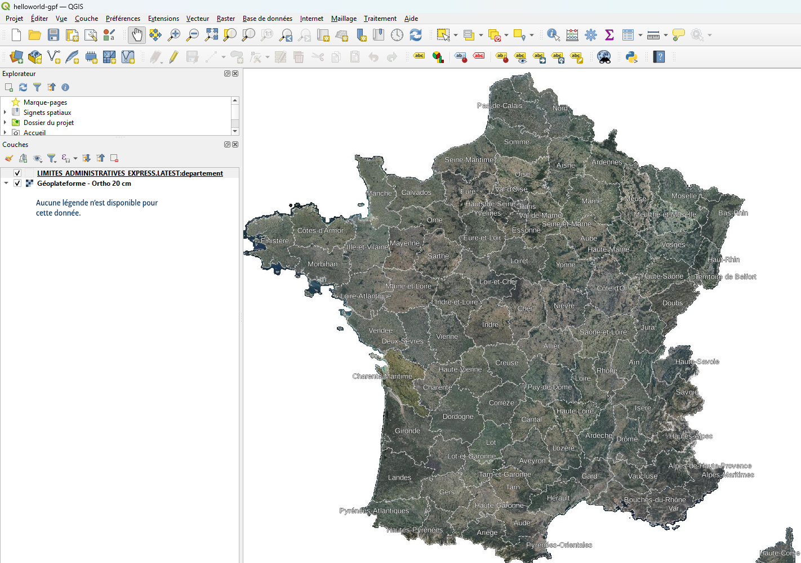

# QGIS

[QGIS](https://qgis.org/) est un SIG libre avec un riche ensemble de fonctionnalités.

## Installation

* [qgis.org - Download QGIS for your platform](https://qgis.org/download/)
* [qgis/install.sh](install.sh) procède à l'installation pour Ubuntu en s'appuyant sur [ppa:ubuntugis/ppa](https://launchpad.net/~ubuntugis/+archive/ubuntu/ppa)

## Ressources

* [qgis/qgis-scale-tiles.xml](qgis-scale-tiles.xml) permet d'éviter des problèmes de ré-échantillonage en alignant les niveaux de zoom avec ceux des pyramides webmercator (WMTS, TMS,...).
* [helloworld-gpf.qgz](./helloworld-gpf.qgz) est une carte d'exemple affichant des flux WMTS et WFS de la Géoplateforme :

