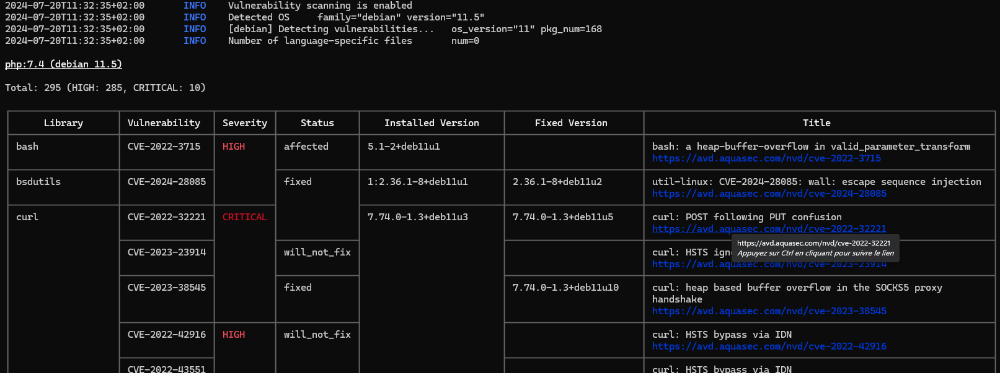

---
tags:
    - Outil
    - Sécurité
    - Scanner de vulnérabilités
    - Kubernetes
    - Conteneurs
    - Virtualisation
search:
    boost: 3
---


# Trivy

[Trivy](https://github.com/aquasecurity/trivy#readme) est un scanner de vulnérabilités capable entre autres de scanner des images de conteneur pour y détecter des dépendances vulnérables.

!!!warning "Trivy a été victime d'un incident de sécurité"

    Voir analyse de Stéphane Robert ( [blog.stephane-robert.info - Trivy compromis une seconde fois : la release v0.69.4 était empoisonnée](https://blog.stephane-robert.info/post/trivy-actii/) ) qui recommande des alernatives : [Grype](https://blog.stephane-robert.info/docs/securiser/outils/grype/) (pour l'analyse des dépendances) et [Syfte](https://blog.stephane-robert.info/docs/securiser/supply-chain/syft/) (pour la génération de SBOM)

## Installation

* [trivy.dev - Getting Started](https://trivy.dev/docs/latest/getting-started/)
* [trivy/install.sh](https://github.com/mborne/mborne.github.io/blob/main/docs/outils/trivy/install.sh) procède au [téléchargement et à l'installation du .deb](https://github.com/aquasecurity/trivy/releases) :

```bash
curl -sS https://mborne.github.io/outils/trivy/install.sh | bash
```

## Utilisation

Pour afficher l'aide :

```bash
# pour les sous-commandes
trivy --help
# pour l'aide au scan d'image
trivy image --help
```

Pour scanner une image :

```bash
trivy image --scanners vuln --severity HIGH,CRITICAL php:7.4
```



## Ressources

* [github.com - aquasecurity/trivy](https://github.com/aquasecurity/trivy#readme)
* [aquasecurity.github.io - trivy - documentation](https://aquasecurity.github.io/trivy/)
