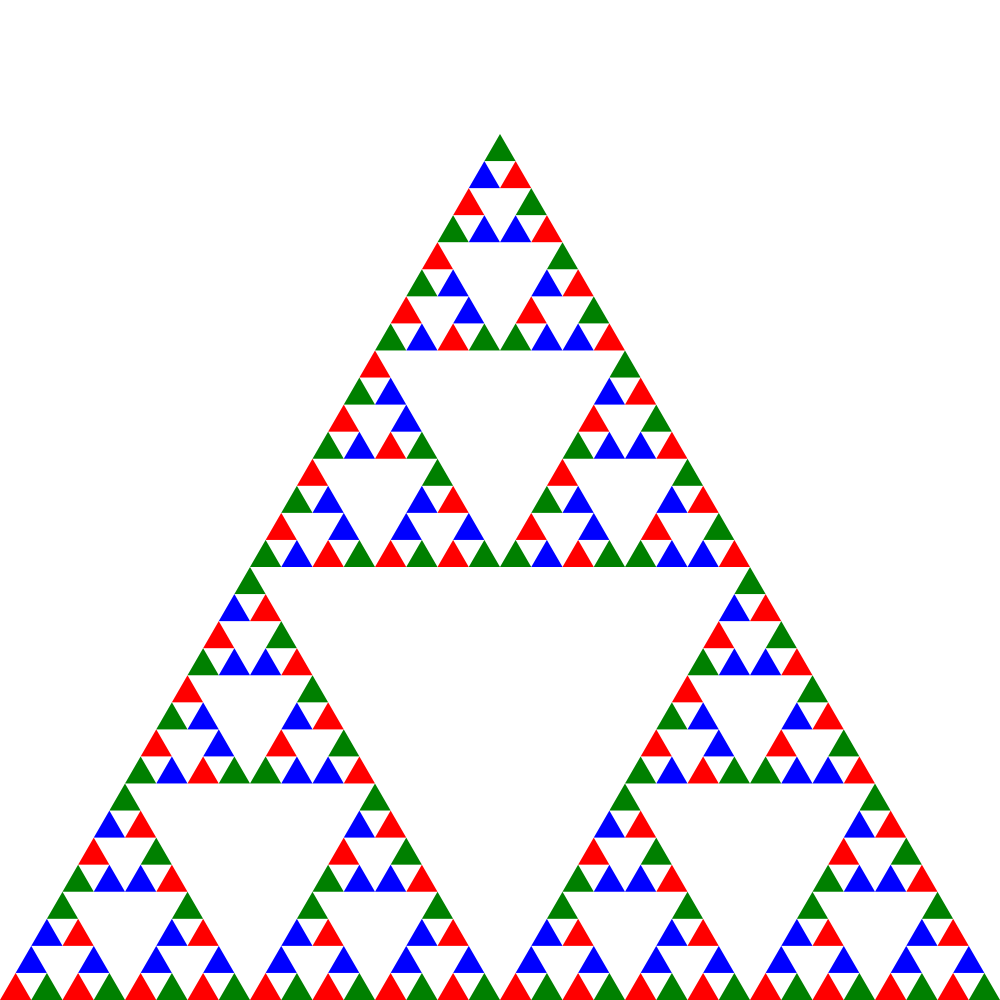

# Sierpenski

Génération de la fractale des [triangles de Sierpenski](https://fr.wikipedia.org/wiki/Triangle_de_Sierpi%C5%84ski) en Python.

## Pré-requis

* Python 3

## Utilisation

```bash
python sierpenski.py  > sierpenski.svg
```

## Résultat



