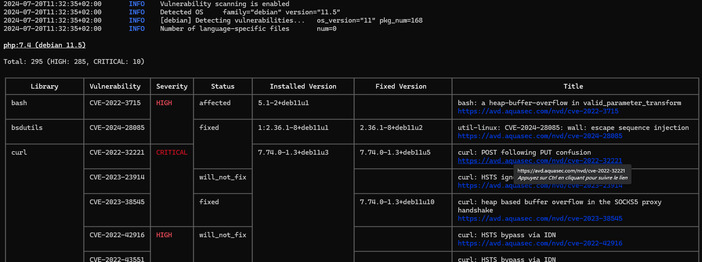

# Trivy

[Trivy](https://github.com/aquasecurity/trivy#readme) est un scanner de vulnérabilités capable entre autres de scanner des images de conteneur ou un OS pour y détecter des dépendances vulnérables.


## Installation

* [trivy/install.sh](install.sh) procède au [téléchargement à l'installation du .deb](https://github.com/aquasecurity/trivy/releases)
* [trivy/latest.sh](latest.sh) permet d'afficher la dernière version (pour maintenance du précédent)

## Utilisation

Pour afficher l'aide :

```bash
# pour les sous-commandes
trivy --help
# pour l'aide au scan d'image
trivy image --help
```

Pour scanner une image :

```bash
trivy image --scanners vuln --severity HIGH,CRITICAL php:7.4
```



## Ressources

* [github.com - aquasecurity/trivy](https://github.com/aquasecurity/trivy#readme)
* [aquasecurity.github.io - trivy - documentation](https://aquasecurity.github.io/trivy/)
